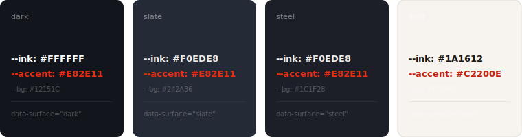
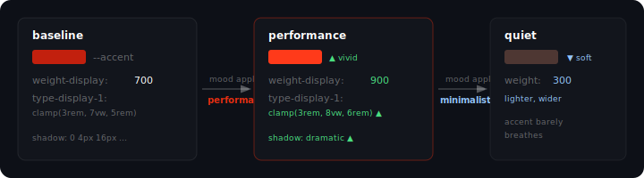
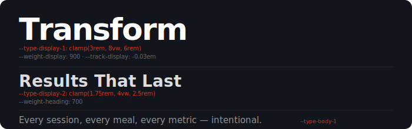

# Tincture

> A drop changes the whole pour.

A surface-aware, multi-axis design substrate for AI-mediated theming. One mood delta shifts an entire visual identity — typography, color, spacing, shadows, radius — coordinated across every surface simultaneously.

**Version:** 0.2.2 · **Status:** Active  
**Origin:** Built for [Arzadon Fitness](https://arzadonfitness.com)'s new site — coming soon. Extracted as a standalone substrate.

---

## The problem it solves

Most design token systems solve the *storage* problem — where do values live? Tincture solves the *composition* problem — how do values relate?

A token in Tincture is a **value matrix**, not a pair. Its value depends on which axes are active: surface (light/dark/steel/slate), flavor (warm/cool), elevation, tone. A mood is a coordinated delta across all of them. Change the mood, every token that cares about it shifts together.

```bash
# Swap the entire visual identity
tincture mood apply performance

# Preview before committing
tincture mood preview luxurious-refined

# Scan for missing surface annotations before deploy
tincture scan
```

---

## How it looks

### Surfaces: one token, four resolutions



The same component renders correctly on all four surfaces with **zero per-surface overrides**. One annotation (`data-surface="dark"`) — the cascade does the rest.

---

### Multi-axis token matrix

A token declares which axes it varies on. Codegen emits one CSS rule per axis-cell:

```json
{
  "ink": {
    "kind": "color",
    "axes": ["surface"],
    "values": {
      "default":                    "#1A1612",
      "surface=dark":               "#FFFFFF",
      "surface=dark,flavor=warm":   "#FAF7F2",
      "surface=steel":              "#F0EDE8"
    }
  }
}
```

→ Emits:

```css
:root                                        { --ink: #1A1612; }
[data-surface="dark"]                        { --ink: #FFFFFF; }
[data-surface="dark"][data-flavor="warm"]    { --ink: #FAF7F2; }
[data-surface="steel"]                       { --ink: #F0EDE8; }
```

No polyfills. No `light-dark()` (it freezes at `:root`'s `color-scheme`; see [`docs/architecture/why-not-automatic.md`](./docs/architecture/why-not-automatic.md)). Standard CSS cascade.

---

### Mood engine: coordinated delta

A mood is a JSON delta — token → axis-cell → new value. Apply one, every consumer token shifts together:



One command. Zero component edits.

---

### Typography axis

Sixteen tokens cover display/body sizing (fluid `clamp()`), weight scale, leading, tracking, and font-family. When a heading uses `font-[var(--weight-heading)]` and `text-[length:var(--type-display-2)]`, any mood that declares a `type-display-2` delta visibly affects every heading on the site — no component changes required.



---

### Brand-lock primitives

Certain tokens are `"locked": true`. The schema validator rejects any mood delta targeting them. The brand's primary mark color is a locked primitive — 30 palette iterations later, the logo is still exactly right.

```json
{
  "brand-mark-primary": {
    "kind": "color",
    "locked": true,
    "axes": [],
    "values": { "default": "#E82E11" },
    "doc": "Brand primary mark. Immutable — moods cannot override."
  }
}
```

```bash
$ tincture mood apply my-experimental-mood
✓ applied: accent #C2200E → #1A56DB
✓ applied: weight-display 700 → 900
✗ rejected: brand-mark-primary is locked (cannot be overridden by moods)
```

---

### Per-page moods

The same `--mood-*` indirection that powers a site-wide swap also activates
a mood on **any wrapper element** in the DOM. One person, one product, one
special route gets its own character — navbar and footer included — without
forking pages or duplicating CSS.

```html
<!-- Whole site renders in default mood — brand red, Oswald -->
<div class="layout">
  <Navbar />

  <!-- This subtree picks up champagne accents + DM Serif headlines.
       Cascade re-resolves under [data-mood="..."] for every nested
       data-surface=dark/light block. -->
  <main data-mood="jennifer-editorial">
    {children}
  </main>

  <Footer />
</div>
```

Mood file is a sparse JSON — only the tokens you actually want different
from the surrounding default. The discipline is *partial-token override*,
not full-palette swap; the page should still belong to the surrounding
identity, with the mood as a deliberate signal layer.

[→ docs/architecture/per-page-moods.md](./docs/architecture/per-page-moods.md)
· [→ src/moods/per-page-example.json](./src/moods/per-page-example.json)
· First production consumer: [Arzadon Fitness](./consumers/arzadon-fitness.md) (`/about/jennifer-arzadon`)

---

### Surface scanner

A build-time scanner flags dark-background sections without surface annotations before they ship:

```bash
$ tincture scan

scanning 47 component files...

⚠  src/components/Hero.tsx:34
   dark background detected without data-surface annotation
   class="... bg-[#12151C] ..."
   → add data-surface="dark" to ensure --ink, --accent resolve correctly

⚠  src/pages/about.tsx:88
   class="bg-gray-900" without data-surface
   → add data-surface="dark"

✓ 45 files clean
2 warnings
```

---

## Token kinds

| Kind | Tokens | Surface-aware |
|---|---|---|
| Color | `ink`, `ink-soft`, `ink-muted`, `accent`, `accent-warm`, `accent-fg`, `bg`, `bg-card`, `bg-elev`, `border`, `border-soft` | ✓ |
| Typography | `font-display`, `font-body`, `font-mono`, `weight-display`, `weight-heading`, `weight-body`, `type-display-{1,2,3}`, `type-body-{1,2,3}`, `leading-tight`, `leading-relaxed`, `track-display`, `track-eyebrow` | Partial |
| Shadow | `shadow-flat`, `shadow-lifted`, `shadow-dramatic` | ✓ |
| Radius | `radius-sm`, `radius-md`, `radius-lg`, `radius-full` | ✗ |
| Brand-lock | `brand-mark-primary`, `brand-mark-secondary`, `brand-mark-fg` | ✗ (immutable) |

---

## Mood presets

| Mood | Character |
|---|---|
| `default` | Baseline. All other moods are deltas from here. |
| `performance` | High-saturation accent, weight 900, tight large type, dramatic shadow |
| `clinical` | Cooler, sharper. Diagnostic precision |
| `editorial-warm` | Parchment + terracotta. Magazine-feature warmth |
| `luxurious-refined` | Champagne accents on slate. Confident restraint |
| `aggressive-bold` | High contrast, heavy weight, vivid |
| `minimalist-quiet` | Whisper-soft. Low contrast. The accent barely breathes |

---

## Quick start

### 1. Install

```bash
npm install @tincture/core
# or
npx @tincture/core init
```

### 2. Configure

Copy `tincture.config.example.json` to `tincture.config.json` at your project root and set your paths:

```json
{
  "registryPath": "src/tokens/registry.json",
  "outDir":       "src/tokens/_generated",
  "moodsDir":     "src/tokens/moods"
}
```

### 3. Generate CSS

```bash
tincture codegen
# → emits src/tokens/_generated/foundation.css + manifest.json + tokens.d.ts
```

### 4. Import

```css
/* globals.css */
@import "tailwindcss";
@import "./tokens/_generated/foundation.css";
```

### 5. Annotate surfaces

```tsx
<section data-surface="dark">
  <h1 style={{ color: 'var(--ink)' }}>Always white on dark</h1>
  <p style={{ color: 'var(--ink-muted)' }}>Always muted</p>
</section>
```

### 6. Apply moods

```bash
tincture mood apply performance
# → patches registry.json → re-runs codegen → new CSS committed
```

---

## Consumer integration: Next.js + Tailwind v4

```tsx
// layout.tsx
const oswald = Oswald({ subsets: ['latin'], variable: '--font-display-stack' });

export default function RootLayout({ children }) {
  return (
    <html lang="en">
      <body className={oswald.variable}>
        {/* Bridge Next/font vars to Tincture's --font-display */}
        <div className="[--font-display:var(--font-display-stack)]">
          {children}
        </div>
      </body>
    </html>
  );
}
```

```css
/* globals.css */
@import "tailwindcss";
@import "./tincture/_generated/foundation.css";
```

**Why the bridge?** Next/font CSS vars are scoped to the element that has the font `className`, not to `:root`. Tincture's `--font-display` needs to reach all descendants — so you bridge once at the layout root.

---

## CLI reference

```
tincture tokens list                    list all semantic tokens
tincture tokens get <id>               single token detail + affected files
tincture tokens find --role <r>        query by role
tincture tokens impact <id>            components + pages affected
tincture tokens set <id> --light <hex> --dark <hex>
                                       write to registry, run codegen
tincture mood list                     list mood presets
tincture mood apply <name>             apply a mood
tincture mood preview <name>           preview without committing
tincture codegen                       re-emit _generated/
tincture scan                          surface annotation scanner
tincture validate                      schema validator
tincture contrast                      WCAG contrast audit
```

---

## Why not X?

**Style Dictionary** (Amazon) — excellent for storing tokens and transforming to platforms (iOS, Android, CSS). Doesn't model surface-awareness, mood composition, or multi-axis tokens.

**Radix Colors** — best-designed color scale system available (12 semantic steps, P3 gamut, auto dark). These are complementary: Radix for generated neutral scales, Tincture for semantic brand tokens that need to be authored and locked.

**Panda CSS** — closest in philosophy. Handles typed tokens and recipes well. No native mood/preset composition. No surface-awareness. React-only. Tincture is framework-agnostic CSS.

**shadcn/ui** — component + theme system, not a substrate. ~40 `hsl()` custom properties with basic dark mode. No token coordination across types. Tincture can layer on top of shadcn primitives.

**Tailwind v4 `@theme`** — gets much closer than v3 did. Flat custom properties, no surface-aware axis model. Tincture's `_generated/foundation.css` imports after `@import "tailwindcss"` and adds the axis layer without conflict.

The core difference: most systems give you a better way to **declare** what your tokens are. Tincture gives you a way to **compose** them — surface × flavor × mood × elevation — so that changing one intent coordinate shifts the whole substrate coherently.

---

## Project structure

```
tincture-css/
├── src/
│   ├── cli/
│   │   ├── tincture.mjs          # CLI entry — tokens, mood, validate
│   │   ├── codegen-v2.mjs        # Registry → CSS + manifest + types
│   │   ├── codegen.mjs           # v0.1 codegen (compatibility)
│   │   ├── mood-v2.mjs           # Mood engine v0.2
│   │   ├── scan-surfaces.mjs     # Build-time annotation scanner
│   │   ├── contrast.mjs          # WCAG contrast audit
│   │   ├── validate.mjs          # Schema validator
│   │   ├── verify.mjs            # Registry integrity check
│   │   ├── preview.mjs           # Mood preview (opens browser)
│   │   ├── create.mjs            # New registry scaffolder
│   │   └── _resolve-config.mjs   # Config discovery (tincture.config.json)
│   ├── schema.mjs                # Registry + mood validator
│   ├── types.ts                  # TypeScript declarations
│   ├── foundation/
│   │   ├── foundation.css        # Source CSS (pre-codegen example)
│   │   └── flavors.css           # Flavor overlay (cool/warm/ember)
│   ├── moods/
│   │   ├── default.json          # Baseline mood (all moods delta from here)
│   │   ├── performance.json
│   │   ├── clinical.json
│   │   ├── editorial-warm.json
│   │   ├── luxurious-refined.json
│   │   ├── aggressive-bold.json
│   │   └── minimalist-quiet.json
│   └── registry.v02-example.json # Reference registry (all token kinds)
├── tests/
│   ├── test-schema.mjs           # 39 schema tests
│   ├── test-codegen.mjs          # 34 codegen tests
│   └── test-migration.mjs        # v0.1 → v0.2 migration tests
├── docs/
│   ├── ARCHITECTURE.md
│   ├── MOODS.md
│   ├── QUICKSTART.md
│   └── architecture/
│       └── why-not-automatic.md
├── tools/
│   └── vscode-tincture/          # VS Code extension (token hover + autocomplete)
├── tincture.config.example.json  # Consumer config template
├── package.json
└── LICENSE
```

---

## Origin

Tincture crystallised in April 2026 while building the new [Arzadon Fitness](https://arzadonfitness.com) site — a Toronto personal training studio. After 30 commits of theme work, a single question about a secondary accent colour made the real problem clear: the *substrate* didn't model what we actually cared about. Surface-aware ink. Moods that coordinate. Tokens that know their axes.

Every mood, surface annotation, and token in this repo runs in that build. The new site is coming soon.

The name comes from the tincture process: a drop of concentrated extract changes the entire pour. One mood delta, one coordinated shift.

---

## License

MIT — see [LICENSE](./LICENSE)
